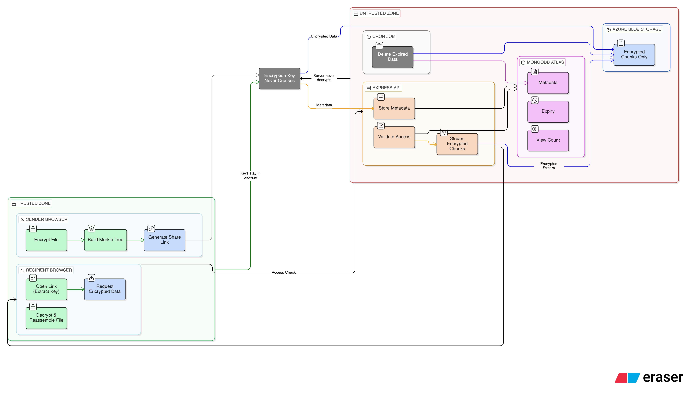
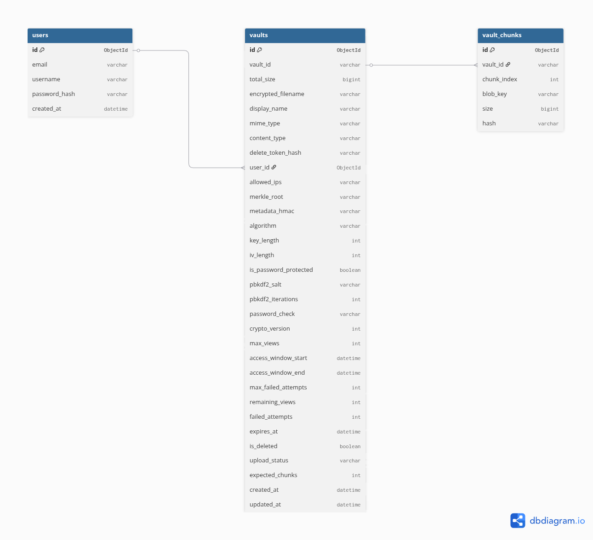

# LinkVault

A secure, ephemeral content sharing app. Upload text or files, get a shareable link, content auto-expires.

Everything is encrypted in the browser before it leaves the client. The server never sees plaintext content or decryption keys.

<!-- **Live:** https://linkvault-app.azurewebsites.net -->

---

## Setup

### Prerequisites

- Node.js v20+
- MongoDB (local or Atlas)
- Azure Blob Storage account 

### 1. Clone

```bash
git clone https://github.com/devchaitanya/LinkVault.git
cd LinkVault
```

### 2. Backend

```bash
cd backend
cp .env.example .env
# Edit .env — fill in your MongoDB URI, Azure connection string, JWT secret
npm install
node index.js
```

Server starts on `http://localhost:3000`.

### 3. Frontend

```bash
cd frontend
cp .env.example .env
# VITE_API_URL defaults to http://localhost:3000/api — change if needed
npm install
npm run dev
```

Dev server starts on `http://localhost:5173`.

### Production Build

```bash
cd frontend
npm run build
```

This outputs static files to `frontend/dist/`. The Express backend can serve them in production.

---

## Project Structure

```
LinkVault/
├── backend/
│   ├── index.js                 # Express entry point
│   └── src/
│       ├── config/              # env vars, DB connection, storage config
│       ├── controllers/         # request handlers
│       ├── middleware/           # auth, validation, rate limiting, security headers
│       ├── models/              # Mongoose schemas (Vault, User)
│       ├── routes/              # Express route definitions
│       ├── services/            # business logic (vault ops, blob storage, cleanup)
│       └── utils/               # helpers (HMAC, nanoid, formatting)
├── frontend/
│   └── src/
│       ├── components/          # reusable UI (upload/, download/, common/, layout/)
│       ├── config/              # client-side constants
│       ├── context/             # React auth context
│       ├── hooks/               # useUpload, useDownload, usePeerPresence
│       ├── pages/               # UploadPage, DownloadPage, DashboardPage, etc.
│       ├── services/            # API client, crypto (Web Crypto API)
│       └── utils/               # formatting helpers, file type detection
└── README.md
```

---

## API Overview

Base URL: `/api`

### Vault Endpoints (`/api/vaults`)

| Method | Path | Description |
|--------|------|-------------|
| POST | `/` | Initialize a new vault (chunked upload session) |
| POST | `/:vaultId/chunks` | Upload one encrypted chunk |
| POST | `/:vaultId/finalize` | Mark upload complete |
| DELETE | `/:vaultId/upload` | Abort a pending upload |
| GET | `/:vaultId` | Get vault metadata (doesn't consume a view) |
| POST | `/:vaultId/access` | Consume a view, get chunk list + download session token |
| GET | `/:vaultId/chunks/:i` | Download one encrypted chunk (needs session token) |
| DELETE | `/:vaultId` | Delete vault (needs delete token or auth) |
| POST | `/:vaultId/fail` | Report a failed access attempt |

### Auth Endpoints (`/api/auth`) — optional feature

| Method | Path | Description |
|--------|------|-------------|
| POST | `/register` | Create account |
| POST | `/login` | Get JWT |
| GET | `/me` | Current user profile |
| GET | `/me/vaults` | List user's vaults (dashboard) |
| POST | `/me/vaults/:vaultId/extend` | Extend expiry or add views |

### Health

| Method | Path | Description |
|--------|------|-------------|
| GET | `/api/health` | Health check |

### Utility

| Method | Path | Description |
|--------|------|-------------|
| GET | `/api/ip` | Returns the client's IP as seen by the server (used for IP restriction UI) |

---

## Database Schema

### Vault (MongoDB)

```
{
  vaultId:            String    — unique, nanoid (21 chars, ~128-bit entropy)
  chunks:             [{ index, blobKey, size, hash }]  — references to Azure blobs
  totalSize:          Number    — total encrypted size in bytes
  encryptedFilename:  String    — AES-GCM encrypted original filename (ciphertext)
  displayName:        String    — plaintext name for owner dashboard only
  mimeType:           String    — MIME type hint
  contentType:        String    — 'text' or 'file'
  deleteTokenHash:    String    — SHA-256 of the delete token (token itself never stored)
  userId:             ObjectId  — ref to User (nullable, for dashboard feature)
  allowedIPs:         [String]  — IP whitelist (optional)
  merkleRoot:         String    — client-computed Merkle root over chunk hashes
  metadataHmac:       String    — HMAC(vaultId + merkleRoot + expiresAt + maxViews)
  cryptoParams: {
    algorithm:          'AES-GCM'
    keyLength:          256
    ivLength:           12
    isPasswordProtected: Boolean
    pbkdf2Salt:         String  — public salt for key derivation
    pbkdf2Iterations:   100000
    passwordCheck:      String  — encrypted test value for password pre-validation
    version:            1
  }
  policy: {
    maxViews:           Number
    accessWindowStart:  Date    — optional time window
    accessWindowEnd:    Date
    maxFailedAttempts:  10
  }
  remainingViews:     Number    — decremented atomically on each access
  failedAttempts:     Number
  expiresAt:          Date      — TTL index auto-deletes expired docs
  isDeleted:          Boolean   — soft delete flag
  uploadStatus:       'pending' | 'complete' | 'failed'
  expectedChunks:     Number
  createdAt:          Date
  updatedAt:          Date
}
```

Indexes: `vaultId` (unique), `expiresAt` (TTL), `uploadStatus + createdAt` (cleanup), `userId`.

### User (MongoDB)

```
{
  email:        String  — unique, lowercase
  username:     String  — unique, 3-30 chars
  passwordHash: String  — bcrypt (12 rounds)
  createdAt:    Date
}
```

---

## Design Decisions

**Why client-side encryption?**
The server never has access to plaintext. Even if the database or blob storage is compromised, content is unreadable without the key fragment in the URL hash. The hash fragment (`#k=...`) is never sent to the server by browsers — it stays client-side only.

**How does IP restriction work in dev and production?**
In production, the backend sees the real client IP via `req.ip` (with `trust proxy` enabled). In local development, all requests appear to come from `127.0.0.1`, so the frontend fetches your public IP from https://api.ipify.org and sends it as the `X-Client-Public-IP` header. The backend uses this header for IP restriction checks if the request is from a private/loopback address. This ensures IP restriction works both locally and in production.

**Why chunked uploads?**
Large files need to be split. Each chunk is encrypted independently with AES-256-GCM (unique IV per chunk), uploaded separately, and stored as individual blobs in Azure. This keeps memory usage bounded and allows resumable uploads.

**Why Azure Blob Storage instead of storing files in MongoDB?**
MongoDB has a 16MB document limit. Binary blobs belong in object storage. Azure Blob Storage handles arbitrarily large files and streams them efficiently. The DB only stores metadata and blob key references.

**Why nanoid for vault IDs?**
21-character nanoid gives ~128 bits of entropy. Effectively impossible to guess. No sequential IDs, no UUIDs that might leak timing info.

**Why JWT for auth?**
Stateless, no session store needed. 7-day expiry. The auth system is an optional bonus feature — the core upload/download flow works without any login.

**Why atomic `findOneAndUpdate` for view counting?**
`remainingViews` is decremented with MongoDB's `$inc` in a single atomic operation. No race condition — two simultaneous requests can't both get the "last" view.

**Expiry handling:**
- Default expiry: 10 minutes (configurable per vault, up to 24h)
- MongoDB TTL index auto-removes expired documents
- A cron job (every 5 min) also cleans up expired vaults and purges their Azure blobs
- Stale pending uploads (no activity for 1 hour) are cleaned up too

**Password protection:**
Uses PBKDF2 to derive a secondary key from the password, combined with the URL key via HKDF. A `passwordCheck` ciphertext is stored so the client can verify the password locally before consuming a view. Wrong passwords never decrement the view counter.

**Rate limiting:**
Global rate limit + stricter limits on auth endpoints and uploads. Uses in-memory store (can swap to Redis via env var).

---

## Assumptions and Limitations

- Maximum file size depends on Azure Blob Storage limits and upload timeout. Tested up to ~100MB.
- The encryption key in the URL hash makes links long. This is a deliberate tradeoff for security.
- No real-time P2P download yet — the P2P mode toggle tracks tab presence via BroadcastChannel but actual WebRTC transfer is not implemented. Falls back to server download.
- In-memory rate limiting resets on server restart. Use Redis in production for persistence.
- No email verification on registration.
- The cleanup cron runs inside the Node process. For production at scale, this should be a separate worker.

- IP restriction works in local development because the frontend sends your public IP (detected via ipify) to the backend. In production, the backend uses the real client IP as seen by the reverse proxy.

---

## Data Flow Diagram

See the full upload-to-storage and download-to-client data flow in:



For details, see [DATAFLOW.md](DATAFLOW.md).

## Database Schema Diagram

See the database schema in:


